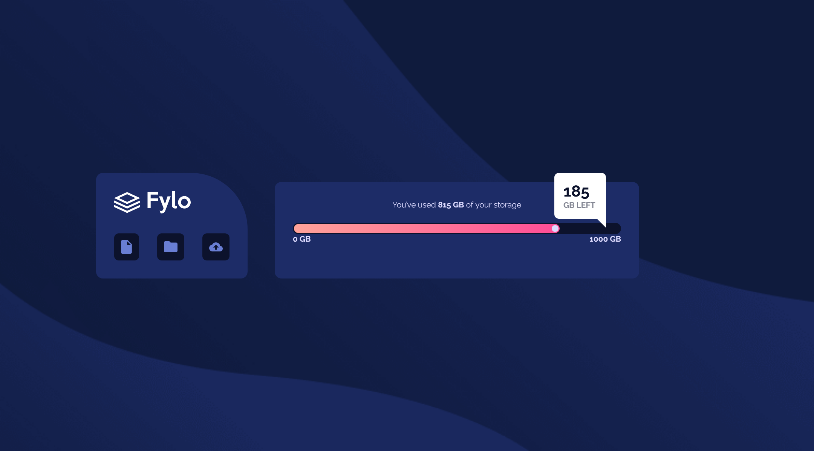

# Frontend Mentor - Fylo data storage component solution

This is a solution to the [Fylo data storage component challenge on Frontend Mentor](https://www.frontendmentor.io/challenges/fylo-data-storage-component-1dZPRbV5n). Frontend Mentor challenges help you improve your coding skills by building realistic projects. 

## Table of contents

- [Overview](#overview)
  - [The challenge](#the-challenge)
  - [Screenshot](#screenshot)
  - [Links](#links)
- [My process](#my-process)
  - [Built with](#built-with)
  - [What I learned](#what-i-learned)
  - [Continued development](#continued-development)
  - [Useful resources](#useful-resources)
- [Author](#author)

## Overview

### The challenge

Users should be able to:

- View the optimal layout for the site depending on their device's screen size

### Screenshot

### Links

- Solution URL: [Add solution URL here](https://your-solution-url.com)
- Live Site URL: [Add live site URL here](https://your-live-site-url.com)

## My process- Mobile-First approach

### Built with

- Semantic HTML5 markup
- CSS custom properties
- Flexbox
- CSS Grid
- Mobile-first workflow

### What I learned

I used pseudo elements to for the indicator limits, the !important tag to override styles and shaped a traingle for th tooltip using pseudo element.

### Continued development

Placing small things at appropriate places always seems like a headache. I had to struggle with placing the tooltip properly. I need to focus more on it.

### Useful resources

- [Equal height for the icons](https://moderncss.dev/equal-height-elements-flexbox-vs-grid/) - This helped me to get all the icons with the same height.
- [Shapes of CSS](https://css-tricks.com/the-shapes-of-css/) - This is an amazing article which helped me with the tooltip. I'd recommend it to anyone still learning this concept.

## Author

- Frontend Mentor - [@HYDROCODER](https://www.frontendmentor.io/profile/HYDROCODER)
