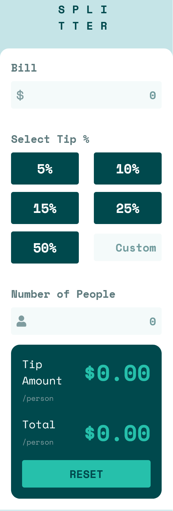
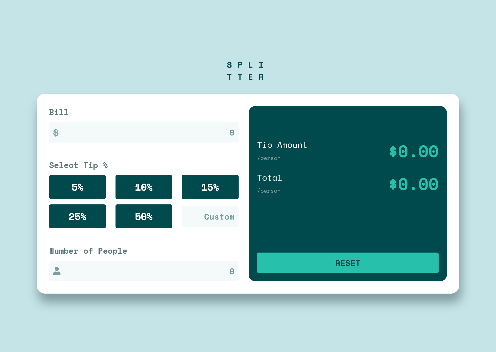

# Frontend Mentor - Tip calculator app solution

This is a solution to the [Tip calculator app challenge on Frontend Mentor](https://www.frontendmentor.io/challenges/tip-calculator-app-ugJNGbJUX). Frontend Mentor challenges help you improve your coding skills by building realistic projects.

## Table of contents

- [Overview](#overview)
  - [The challenge](#the-challenge)
  - [Screenshot](#screenshot)
  - [Links](#links)
- [My process](#my-process)
  - [Built with](#built-with)
  - [What I learned](#what-i-learned)
  - [Useful resources](#useful-resources)

## Overview

### The challenge

Users should be able to:

- View the optimal layout for the app depending on their device's screen size
- See hover states for all interactive elements on the page
- Calculate the correct tip and total cost of the bill per person

### Screenshot

### Links

- Solution URL: [Solution](https://github.com/HYDROCODER/frontend-mentor-challenges/tree/main/tip-calculator-app-main)
- Live Site URL: [Live Site](https://hydrocoder.github.io/frontend-mentor-challenges/tip-calculator-app-main/index.html)

## My process

### Built with

- Semantic HTML5 markup
- CSS custom properties
- Flexbox
- CSS Grid
- Mobile-first workflow

### What I learned

Working with forms always seems like a headache to me but I feel to be improving in this area. Styling inputs was a new thing I learnt and it was real hard. I got through it however, by using pseudo selectors, the dir attribute to take input from right to left, removing the spinners in the number inputs, checked pseudo class, using toggle for classList object to show or hide the error text, etc.. Apparently, working with numbers in js is not easy when it involves decimals. 
I did make a people icon of my own but it was not possible to use it in the input wrapper's pseudo selector so I just used font-awesome. It was a good experience.

### Useful resources

- [Styling radio buttons](https://www.viralpatel.net/css-radio-button-checkbox-background/) - This helped me for styling the radio inputs with the labels.

